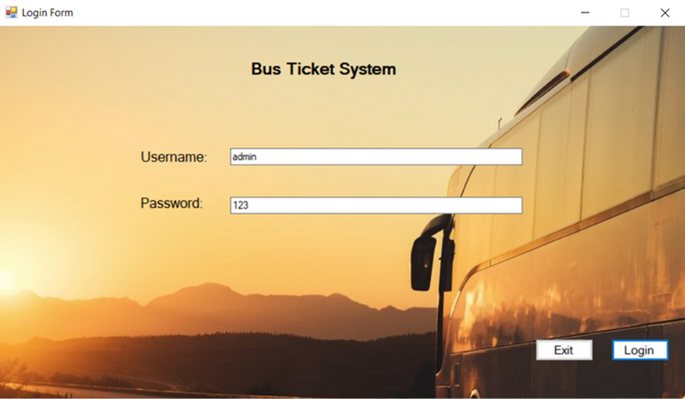
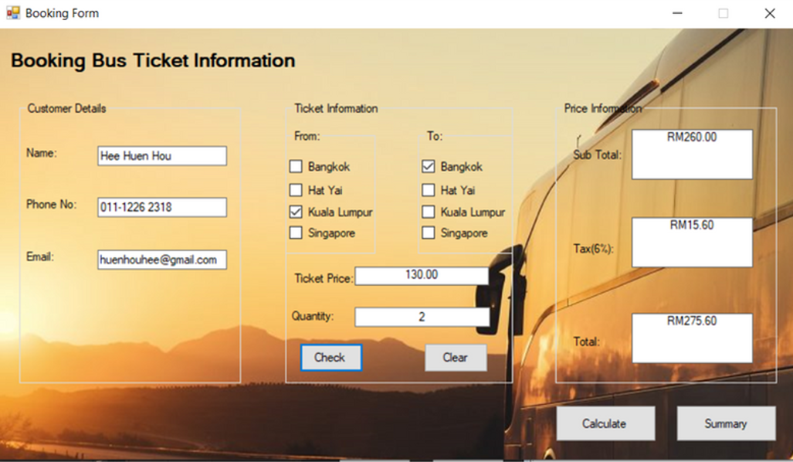
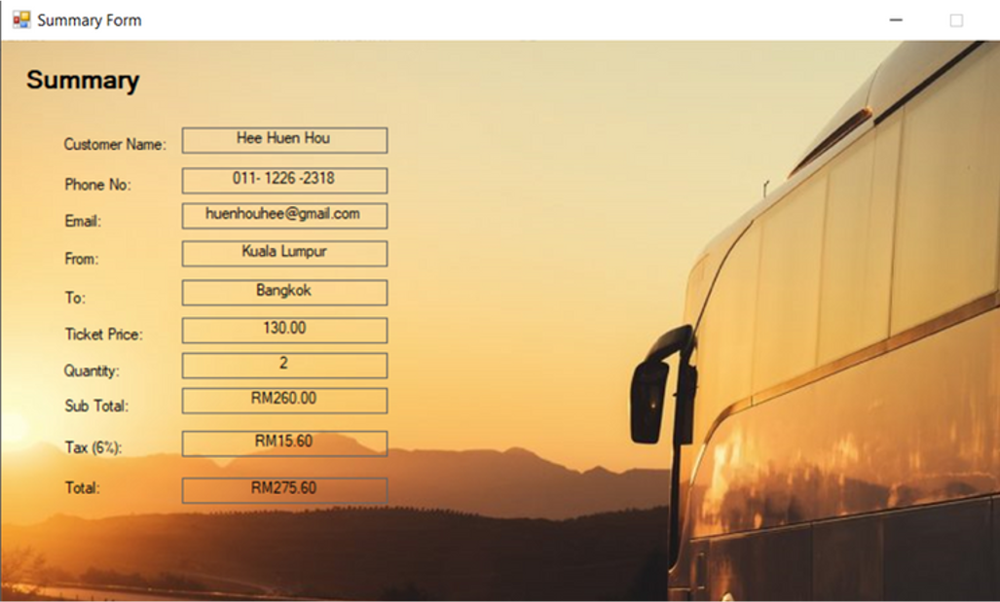

# Bus Ticket System
A ticket booking system that allows users to reserve bus tickets and manage their orders.

---

## Overview
The Bus Ticket System is designed to simplify the process of booking bus tickets online. Users can log in, browse available trips and view their booking details.

This group project was developed as part of my learning and portfolio to demonstrate system design, user authentication, and transaction handling.

---

## Features
- User authentication (Login system)
- Book bus tickets
- View order and booking details
- Simple and user-friendly interface

---

## Screenshots
- Login page

- Ticket booking page

- Order details page

---